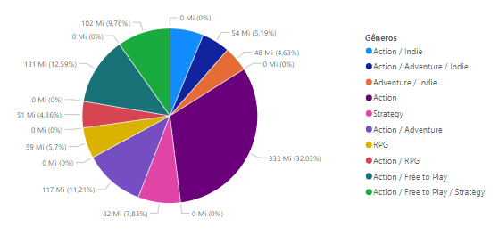
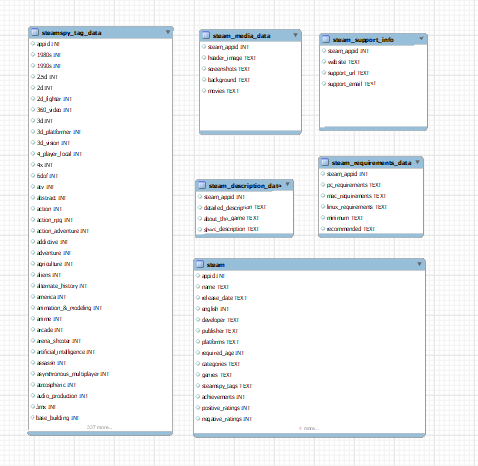

 # Dados-steam 📊

## Sobre o projeto 📈
Se trata de  um dashboard com base em um conjunto de dados, a fim de realizar um apresentação com a exploração dos dados.

## Layout🔠

## Banco de Dados 🗃️ 

## Tecnologias utilizadas 🤖
- Mysql 
- Power Bi

## Como executar o projeto 🔄
- Faça o download dos arquivos da pasta (database).
- importe todos os dados para o Mysql workbench.
- faça o download dos scripts na pasta (queries).
- use scripts prontos para pesquisas ou faça suas proprias pesquisas.

### Contribuição 🧑‍🤝‍🧑

Amanda Alexandre| <a href="https://github.com/amandaalexandre">Github</a>   
Rafael Silva|<a href="https://github.com/Rafael753">Github</a>  
Anderson Souza|<a href="https://github.com/Andersonjmc">Github</a>  
Diego Silva|<a href="https://github.com/diegoed1">Github</a>  
Atos Godoy|<a href="https://github.com/atosgodoy">Github</a> 

